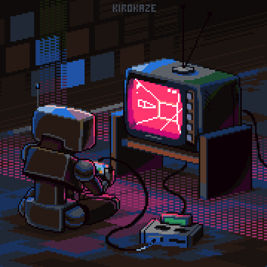
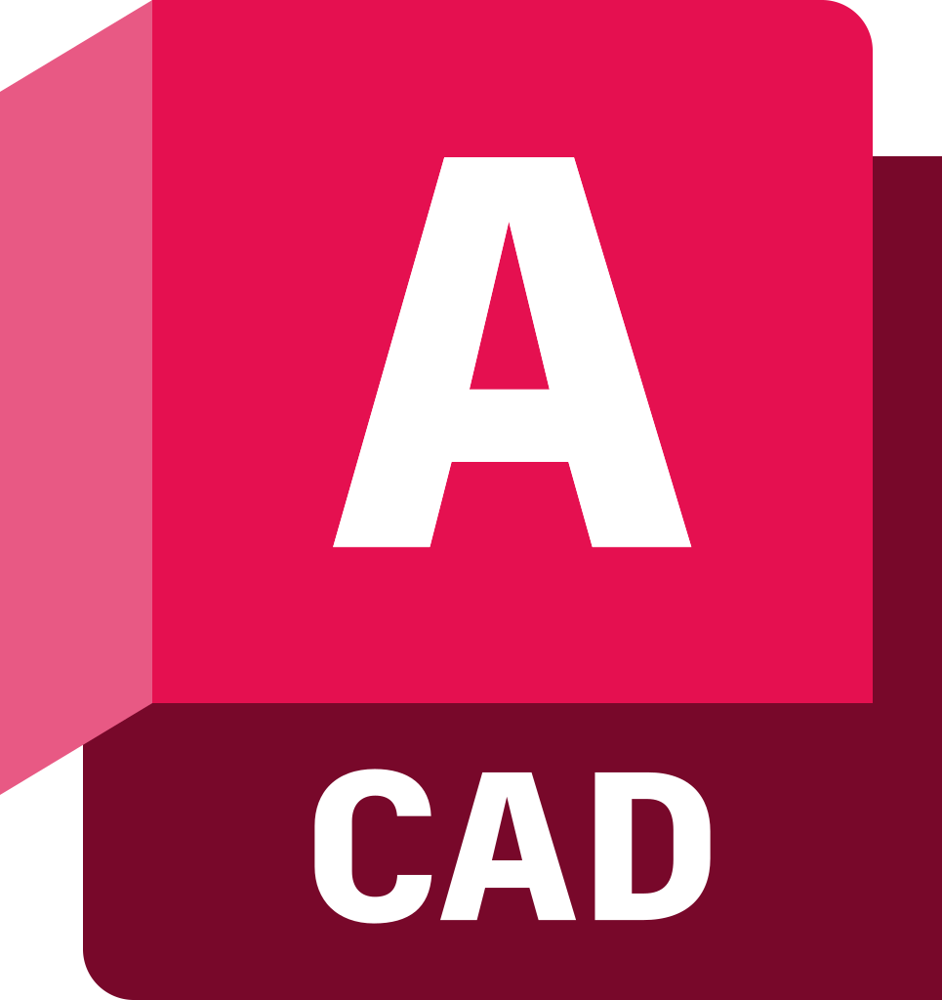
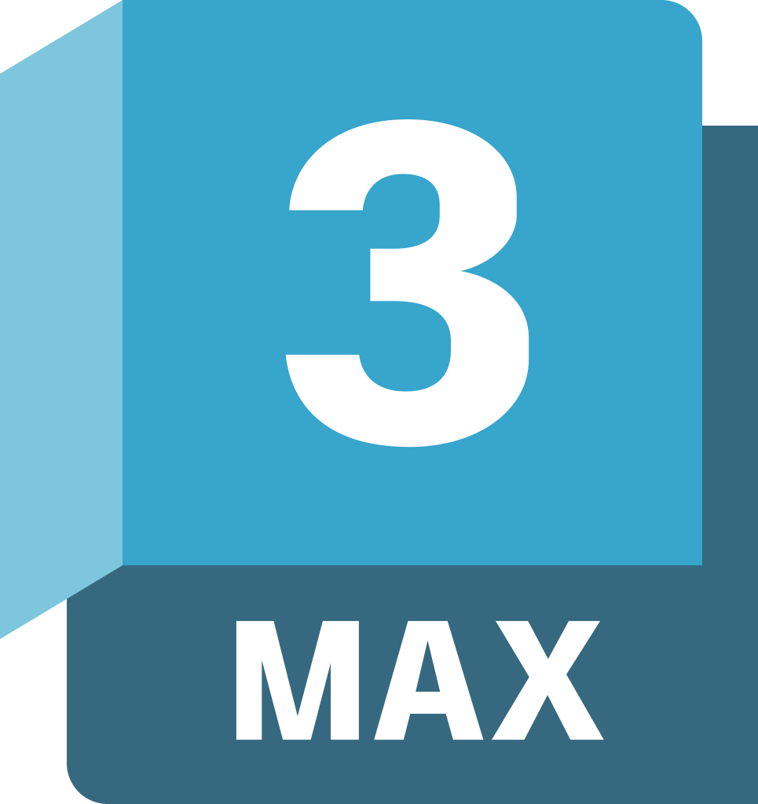

### <samp>&gt; Olá, eu sou <a href="https://juniornsantos.github.io/portfolio_Junior/#home" target="_blank">Júnior Nogueira</a>  </samp>

### Contente por te ver aqui! &nbsp; 

Um homem excepcional passando por situações extraordinárias!👊🏻
 Eu sou um desenvolvedor full-stack. Gosto de programar, resolver problemas e viajar.

Como desenvolvedor, gosto de usar minha atenção obsessiva aos detalhes, meu amor inequívoco por fazer coisas que mudam o mundo. É por isso que gosto de fazer coisas que fazem a diferença.
<!--  -->

 

😀 **Falando algumas coisas:**

- &nbsp;&nbsp; Atualmente prestando serviços para a empresa [@Grupo Brisanet](https://www.brisanet.com.br/);
- &nbsp;&nbsp; Atualmente estou aprendendo Estruturas de Dados, Dart, Flutter;
- &nbsp;&nbsp; Sou Especialista em desenho técnico [@Expert Elite](https://www.autodesk.com.br/expert-elite/overview) [AutoCAD, C3D, Maya, 3Ds MAX]. 
- &nbsp;&nbsp; Pergunte-me sobre qualquer coisa, Fico feliz em ajudar;
- &nbsp;&nbsp; Contato: frjuniornogueira1@gmail.com;
- &nbsp;&nbsp; [Portfolio](https://juniornsantos.github.io/portfolio_Junior/#home).
 

📊 **Esta semana eu gastei meu tempo em:**

  
   
   
  
    
    
  
  
  
  
  

 
 
 

📈 **Minhas estatísticas do GitHub:** 

  <a href="https://github.com/juniornsantos">
  
  

<!--  -->